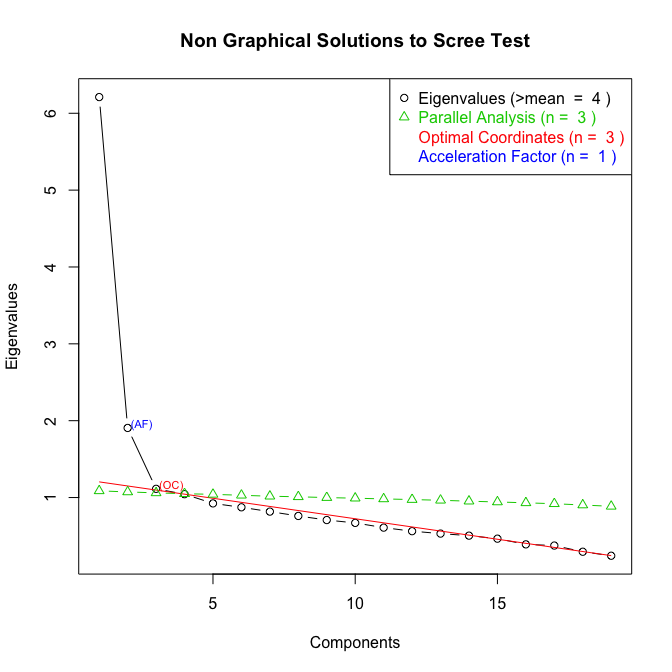

Faculty Satisfaction and Attrition Intentions Analysis
================
Chad Evans

Built with 3.3.2. Last run on 2017-11-07.

-   [Configure](#configure)
    -   Libraries
    -   directories
    -   data
-   [Munge](#munge)
-   Exploratory Analysis
-   [Descriptive Statistics](#descriptive-statistics)
-   [Exploratory Factor Analysis](#exploratory-factor-analysis)
    -   [Factors](#factors)
    -   [Cronbach Alphas](#cronbach-alphas)
-   [Confirmatory Factor Analysis](#confirmatory-factor-analysis)
    -   [Measurement Invariance](#measurement-invariance)
-   [Model Specification with Training Data](#model-specification-with-training-data)
    -   [Linear Training Model with Robust SEs](#linear-training-model-with-robust-ses)
-   [Model Evaluation with Test Data](#model-evaluation-with-test-data)
    -   [Bayesian Multi-level Models](#bayesian-multi-level-models)

Configure
---------

Munge
-----

``` r
source(file.path(Munge, "01_Merge_the_data.R"))
source(file.path(Munge, "02_Clean_the_data.R"))
source(file.path(Munge, "03_Recode.R"))
save(df, file=file.path(Private_Cache,"Cleaned_HERI.RData"))
```

``` r
load(file.path(Private_Cache,"Cleaned_HERI.RData"))
```

Exploratory Analysis
--------------------

``` r
source(file.path(Diagnostics, "Diagnostics.R"))
```

Descriptive Statistics
----------------------

``` r
GAPPAnames<-c("Full-time","Aspiring Academic","Career-Ender","Expert","Freelancer")
VARS<-c("AGE", "SEX","MARITAL2","RACEGROUP2","DEGEARN2","PRINACT2","INSTCONT","CARNEGIE2","BIGLAN","SELECTIVITY2","OBEREG")
table<-round(nfCrossTable(data=df[,VARS],CTvar=as.integer(df$GAPPANTT)),2)
colnames(table)<-GAPPAnames
rownames(table)<-c("Avg. Age","Female","Married","White","Ph.D.","Professional","Masters","BA or Less","Teacher","Researcher","Administrator/Other","Public","Research I","Research II","Research III/Doctoral","Bachelor's/Master's","Associates/Other","Hard/Applied","Hard/Pure","Soft/Applied","Soft/Pure","Other","Selective","East","West/Other","Midwest","South")
kable(table, caption = "Distribution of Adjunct Clusters by Work Characteristics")
```

|                       |  Full-time|  Aspiring Academic|  Career-Ender|  Expert|  Freelancer|
|-----------------------|----------:|------------------:|-------------:|-------:|-----------:|
| Avg. Age              |      48.59|              54.94|         63.98|   49.32|       46.48|
| Female                |       0.56|               0.52|          0.44|    0.40|        0.62|
| Married               |       0.77|               0.83|          0.79|    0.76|        0.74|
| White                 |       0.84|               0.89|          0.80|    0.78|        0.79|
| Ph.D.                 |       0.37|               0.24|          0.29|    0.14|        0.27|
| Professional          |       0.09|               0.11|          0.14|    0.12|        0.07|
| Masters               |       0.49|               0.54|          0.48|    0.64|        0.59|
| BA or Less            |       0.05|               0.11|          0.09|    0.10|        0.07|
| Teacher               |       0.80|               0.95|          0.95|    0.98|        0.96|
| Researcher            |       0.04|               0.01|          0.02|    0.01|        0.01|
| Administrator/Other   |       0.17|               0.04|          0.04|    0.02|        0.02|
| Public                |       0.38|               0.38|          0.46|    0.39|        0.47|
| Research I            |       0.05|               0.05|          0.05|    0.05|        0.04|
| Research II           |       0.21|               0.15|          0.12|    0.16|        0.13|
| Research III/Doctoral |       0.09|               0.05|          0.07|    0.06|        0.06|
| Bachelor's/Master's   |       0.64|               0.71|          0.69|    0.68|        0.73|
| Associates/Other      |       0.01|               0.05|          0.08|    0.04|        0.04|
| Hard/Applied          |       0.35|               0.36|          0.28|    0.47|        0.22|
| Hard/Pure             |       0.04|               0.03|          0.05|    0.01|        0.03|
| Soft/Applied          |       0.19|               0.20|          0.25|    0.17|        0.17|
| Soft/Pure             |       0.33|               0.34|          0.37|    0.29|        0.51|
| Other                 |       0.09|               0.07|          0.06|    0.06|        0.07|
| Selective             |       0.14|               0.06|          0.03|    0.03|        0.06|
| East                  |       0.32|               0.26|          0.28|    0.26|        0.26|
| West/Other            |       0.25|               0.33|          0.33|    0.31|        0.37|
| Midwest               |       0.29|               0.38|          0.29|    0.38|        0.34|
| South                 |       0.14|               0.03|          0.09|    0.05|        0.03|

``` r
prop.table(table(df$GAPPANTT))
```

    ## 
    ##            FT NTT Aspiring Academic      Career-Ender            Expert 
    ##        0.50705645        0.21124552        0.01456093        0.09565412 
    ##        Freelancer 
    ##        0.17148297

Exploratory Factor Analysis
---------------------------

This project will use data to help specify the model. In order to prevent overfitting, I split the data into a training subset and a test subset (60/40). The training data will be used for model development. The test data will not have any role in construction of the model, making observations fully independent. This helps to ensure that the final model I specify will generalize to the population.

``` r
smp_size <- floor(0.60 * nrow(df)) ## 60% of the sample size (for training data)

set.seed(1)
train_ind <- sample(seq_len(nrow(df)), size = smp_size)

df_train <- df[train_ind, ]
df_test <- df[-train_ind, ]
```

Let's subset the satisfaction items (from the training data). Let's also exclude the global measure of job satisfaction (overall how satisfied are you with your job) as we are interested in components of job satisfaction--not overall job satisfaction.

``` r
dfS <- df_train %>% select(starts_with("SATIS"),-SATIS19,-SATIS_WORKPLACE,-SATIS_COMPENSATION)
```

We need to determine the optimal number of satisfaction factors for this analysis. To do so, we calculate the correlation matrix and use eigenvalues, a scree plot and some theory to determine the optimal number of factors. FIML is used for missingness.

``` r
corMat<-corFiml(dfS, covar = FALSE,show=FALSE) # Covariance Matrix from FIML
ev <- eigen(corMat) # get eigenvalues
ap <- parallel(subject=nrow(dfS),var=ncol(dfS),rep=100,cent=.05)
nS <- nScree(x=ev$values, aparallel=ap$eigen$qevpea)
plotnScree(nS)
```



This plot and these diagnostics suggest that three to four factors would be most appropriate (I opt for four). Now we can conduct the exploratory Factor Analysis. I chose the oblique option because I expect correlation between subjects latent satisfaction factors. I chose principal axis (pa) factoring because I am most interested in identifying the underlying constructs in the data.

``` r
nfactors<-4
solution <- fa(r = corMat, covar=F, nfactors = nfactors, rotate = 'oblimin', fm = 'pa') 
print(solution$loadings, cutoff=.32)
```

    ## 
    ## Loadings:
    ##         PA1    PA4    PA3    PA2   
    ## SATIS01         0.409              
    ## SATIS02                       0.816
    ## SATIS03                       0.839
    ## SATIS04         0.411              
    ## SATIS05  0.365  0.393              
    ## SATIS06  0.338                     
    ## SATIS07                            
    ## SATIS08  0.569                     
    ## SATIS09                0.891       
    ## SATIS10                0.782       
    ## SATIS11                0.406       
    ## SATIS12         0.560              
    ## SATIS13  0.370                     
    ## SATIS14  0.636                     
    ## SATIS15  0.652                     
    ## SATIS16         0.373              
    ## SATIS17         0.814              
    ## SATIS18  0.323                     
    ## SATIS20                       0.322
    ## 
    ##                  PA1   PA4   PA3   PA2
    ## SS loadings    1.839 1.751 1.730 1.703
    ## Proportion Var 0.097 0.092 0.091 0.090
    ## Cumulative Var 0.097 0.189 0.280 0.370

The only item that failed to load (substantially) onto a factor was SATIS07 (satisfaction with office space). Each of the four factors explains about 9-10% of the variation. How did the items load onto the factors and what factor names seem appropriate?

### Factors

``` r
Satis_questions<-read_csv(file.path(Raw,"Satisfaction_questions.csv"))[c(1:18, 20),]
ldf<-as_data_frame(solution$loadings[,]) %>%
  cbind(Satis_questions)
rm(Satis_questions)
Factor=NA
for(i in 1:nrow(ldf)){
  Factor[i]<-which.max(ldf[i,c(1:nfactors)])
}
ldf<- ldf %>% 
  mutate("Factor" = Factor) %>% 
  arrange(Factor) %>% 
  mutate(Factor = factor(Factor, labels = c("Work","Terms","Relationships","Benefits"))) 
ldf[,c(5,7)] 
```

    ##                   Respondent's satisfaction with:        Factor
    ## 1                             Quality of students          Work
    ## 2                                Office/lab space          Work
    ## 3                       Autonomy and independence          Work
    ## 4                         Departmental leadership          Work
    ## 5                              Course assignments          Work
    ## 6             Freedom to determine course content          Work
    ## 7                 Clerical/administrative support          Work
    ## 8                                          Salary         Terms
    ## 9              Opportunity for scholarly pursuits         Terms
    ## 10                                  Teaching load         Terms
    ## 11                                   Job security         Terms
    ## 12 Availability of child care at this institution         Terms
    ## 13               Prospects for career advancement         Terms
    ## 14  Professional relationships with other faculty Relationships
    ## 15        Social relationships with other faculty Relationships
    ## 16                       Competency of colleagues Relationships
    ## 17                                Health benefits      Benefits
    ## 18                            Retirement benefits      Benefits
    ## 19 Tuition remission for your children/dependents      Benefits

Examining which items loaded onto which factors, we see that reasonable factor names would be work, terms, benefits and relationships.

``` r
FT <- ldf %>% 
  select(Factor,`Respondent's satisfaction with:`) %>% 
  group_by(Factor) %>%
  mutate(id=1:n()) %>% 
  spread(Factor, `Respondent's satisfaction with:`) %>% 
  select(-id)
kable(FT)
```

| Work                                | Terms                                          | Relationships                                 | Benefits                                       |
|:------------------------------------|:-----------------------------------------------|:----------------------------------------------|:-----------------------------------------------|
| Quality of students                 | Salary                                         | Professional relationships with other faculty | Health benefits                                |
| Office/lab space                    | Opportunity for scholarly pursuits             | Social relationships with other faculty       | Retirement benefits                            |
| Autonomy and independence           | Teaching load                                  | Competency of colleagues                      | Tuition remission for your children/dependents |
| Departmental leadership             | Job security                                   | NA                                            | NA                                             |
| Course assignments                  | Availability of child care at this institution | NA                                            | NA                                             |
| Freedom to determine course content | Prospects for career advancement               | NA                                            | NA                                             |
| Clerical/administrative support     | NA                                             | NA                                            | NA                                             |

### Cronbach Alphas

What is the internal validity of each factor? Let's conduct a cronbach alpha measure of internal consistency.

``` r
alphas=NULL
for(i in levels(ldf$Factor)){
    items<- ldf %>% 
      as_data_frame %>% 
      select(Item, Factor) %>%  
      filter(Factor==i) %>% 
      select(Item) %>% 
      unlist()
    rawalpha<- dfS[names(dfS) %in% items] %>% 
      psych::alpha()
    alphas[i]<-round(rawalpha$total$raw_alpha,2)
}
print(alphas)
```

    ##          Work         Terms Relationships      Benefits 
    ##          0.75          0.78          0.80          0.70

Now we have an EFA-induced factor structure to utilize in a Confirmatory Factor Analysis.

Confirmatory Factor Analysis
----------------------------

Now let's use this model to conduct the confirmatory factor analysis. I utilize FIML to deal with missingness in the data.

``` r
CFAModel <- ' 
Work =~ SATIS05+SATIS06+SATIS07+SATIS08+SATIS13+SATIS14+SATIS15+SATIS18
Terms =~ SATIS01+SATIS04+SATIS12+SATIS16+SATIS17
Relations =~ SATIS09+SATIS10+SATIS11
Benefits =~ SATIS02+SATIS03+SATIS20
'
CFAfit<-cfa(CFAModel, data=dfS,  missing = "fiml")
summary(CFAfit, standardized=T, fit.measures = TRUE)
```

    ## lavaan (0.5-23.1097) converged normally after  78 iterations
    ## 
    ##                                                   Used       Total
    ##   Number of observations                          5372        5388
    ## 
    ##   Number of missing patterns                       734
    ## 
    ##   Estimator                                         ML
    ##   Minimum Function Test Statistic             3322.726
    ##   Degrees of freedom                               146
    ##   P-value (Chi-square)                           0.000
    ## 
    ## Model test baseline model:
    ## 
    ##   Minimum Function Test Statistic            28680.318
    ##   Degrees of freedom                               171
    ##   P-value                                        0.000
    ## 
    ## User model versus baseline model:
    ## 
    ##   Comparative Fit Index (CFI)                    0.889
    ##   Tucker-Lewis Index (TLI)                       0.869
    ## 
    ## Loglikelihood and Information Criteria:
    ## 
    ##   Loglikelihood user model (H0)             -97634.123
    ##   Loglikelihood unrestricted model (H1)     -95972.760
    ## 
    ##   Number of free parameters                         63
    ##   Akaike (AIC)                              195394.247
    ##   Bayesian (BIC)                            195809.351
    ##   Sample-size adjusted Bayesian (BIC)       195609.157
    ## 
    ## Root Mean Square Error of Approximation:
    ## 
    ##   RMSEA                                          0.064
    ##   90 Percent Confidence Interval          0.062  0.066
    ##   P-value RMSEA <= 0.05                          0.000
    ## 
    ## Standardized Root Mean Square Residual:
    ## 
    ##   SRMR                                           0.056
    ## 
    ## Parameter Estimates:
    ## 
    ##   Information                                 Observed
    ##   Standard Errors                             Standard
    ## 
    ## Latent Variables:
    ##                    Estimate  Std.Err  z-value  P(>|z|)   Std.lv  Std.all
    ##   Work =~                                                               
    ##     SATIS05           1.000                               0.493    0.568
    ##     SATIS06           0.751    0.028   26.853    0.000    0.371    0.452
    ##     SATIS07           0.988    0.037   26.871    0.000    0.488    0.486
    ##     SATIS08           0.965    0.029   32.948    0.000    0.476    0.630
    ##     SATIS13           1.178    0.036   32.350    0.000    0.581    0.608
    ##     SATIS14           1.067    0.030   35.967    0.000    0.526    0.686
    ##     SATIS15           0.902    0.029   30.635    0.000    0.445    0.566
    ##     SATIS18           0.922    0.033   27.704    0.000    0.455    0.486
    ##   Terms =~                                                              
    ##     SATIS01           1.000                               0.540    0.600
    ##     SATIS04           1.181    0.034   34.824    0.000    0.638    0.691
    ##     SATIS12           1.189    0.035   34.007    0.000    0.643    0.645
    ##     SATIS16           0.864    0.070   12.400    0.000    0.467    0.441
    ##     SATIS17           1.278    0.036   35.526    0.000    0.691    0.735
    ##   Relations =~                                                          
    ##     SATIS09           1.000                               0.747    0.903
    ##     SATIS10           0.902    0.015   60.506    0.000    0.674    0.791
    ##     SATIS11           0.583    0.014   41.286    0.000    0.436    0.587
    ##   Benefits =~                                                           
    ##     SATIS02           1.000                               0.765    0.779
    ##     SATIS03           1.106    0.027   40.373    0.000    0.846    0.889
    ##     SATIS20           0.700    0.039   17.986    0.000    0.536    0.461
    ## 
    ## Covariances:
    ##                    Estimate  Std.Err  z-value  P(>|z|)   Std.lv  Std.all
    ##   Work ~~                                                               
    ##     Terms             0.196    0.008   24.301    0.000    0.735    0.735
    ##     Relations         0.261    0.009   29.047    0.000    0.708    0.708
    ##     Benefits          0.163    0.009   18.453    0.000    0.431    0.431
    ##   Terms ~~                                                              
    ##     Relations         0.203    0.008   24.292    0.000    0.503    0.503
    ##     Benefits          0.267    0.011   23.558    0.000    0.645    0.645
    ##   Relations ~~                                                          
    ##     Benefits          0.150    0.011   14.035    0.000    0.262    0.262
    ## 
    ## Intercepts:
    ##                    Estimate  Std.Err  z-value  P(>|z|)   Std.lv  Std.all
    ##    .SATIS05           2.578    0.012  213.475    0.000    2.578    2.966
    ##    .SATIS06           2.711    0.011  240.824    0.000    2.711    3.305
    ##    .SATIS07           2.688    0.014  185.381    0.000    2.688    2.678
    ##    .SATIS08           3.214    0.010  310.088    0.000    3.214    4.254
    ##    .SATIS13           2.940    0.013  223.074    0.000    2.940    3.075
    ##    .SATIS14           3.029    0.011  285.335    0.000    3.029    3.949
    ##    .SATIS15           3.288    0.011  301.041    0.000    3.288    4.185
    ##    .SATIS18           2.866    0.013  219.394    0.000    2.866    3.061
    ##    .SATIS01           2.260    0.012  183.174    0.000    2.260    2.511
    ##    .SATIS04           2.371    0.014  173.112    0.000    2.371    2.569
    ##    .SATIS12           2.307    0.014  166.494    0.000    2.307    2.317
    ##    .SATIS16           1.866    0.035   53.602    0.000    1.866    1.762
    ##    .SATIS17           2.049    0.014  147.586    0.000    2.049    2.179
    ##    .SATIS09           3.042    0.011  267.464    0.000    3.042    3.676
    ##    .SATIS10           2.847    0.012  236.774    0.000    2.847    3.342
    ##    .SATIS11           3.176    0.010  309.755    0.000    3.176    4.273
    ##    .SATIS02           2.650    0.015  174.583    0.000    2.650    2.699
    ##    .SATIS03           2.533    0.015  174.111    0.000    2.533    2.660
    ##    .SATIS20           2.758    0.026  104.960    0.000    2.758    2.371
    ##     Work              0.000                               0.000    0.000
    ##     Terms             0.000                               0.000    0.000
    ##     Relations         0.000                               0.000    0.000
    ##     Benefits          0.000                               0.000    0.000
    ## 
    ## Variances:
    ##                    Estimate  Std.Err  z-value  P(>|z|)   Std.lv  Std.all
    ##    .SATIS05           0.512    0.011   45.548    0.000    0.512    0.678
    ##    .SATIS06           0.536    0.011   48.900    0.000    0.536    0.796
    ##    .SATIS07           0.770    0.017   45.389    0.000    0.770    0.764
    ##    .SATIS08           0.344    0.008   44.359    0.000    0.344    0.603
    ##    .SATIS13           0.577    0.013   45.107    0.000    0.577    0.631
    ##    .SATIS14           0.311    0.008   41.457    0.000    0.311    0.529
    ##    .SATIS15           0.419    0.009   45.484    0.000    0.419    0.679
    ##    .SATIS18           0.669    0.014   47.386    0.000    0.669    0.764
    ##    .SATIS01           0.518    0.012   43.850    0.000    0.518    0.640
    ##    .SATIS04           0.445    0.012   36.112    0.000    0.445    0.522
    ##    .SATIS12           0.578    0.014   40.928    0.000    0.578    0.583
    ##    .SATIS16           0.904    0.047   19.059    0.000    0.904    0.806
    ##    .SATIS17           0.406    0.013   32.319    0.000    0.406    0.460
    ##    .SATIS09           0.127    0.007   17.463    0.000    0.127    0.185
    ##    .SATIS10           0.271    0.008   35.584    0.000    0.271    0.374
    ##    .SATIS11           0.362    0.008   46.035    0.000    0.362    0.656
    ##    .SATIS02           0.379    0.015   25.689    0.000    0.379    0.393
    ##    .SATIS03           0.191    0.015   12.361    0.000    0.191    0.210
    ##    .SATIS20           1.066    0.039   27.532    0.000    1.066    0.788
    ##     Work              0.243    0.012   20.325    0.000    1.000    1.000
    ##     Terms             0.292    0.014   21.451    0.000    1.000    1.000
    ##     Relations         0.559    0.015   37.805    0.000    1.000    1.000
    ##     Benefits          0.586    0.023   25.266    0.000    1.000    1.000

``` r
fitMeasures(CFAfit, c("chisq","cfi","tli","rmsea"))
```

    ##    chisq      cfi      tli    rmsea 
    ## 3322.726    0.889    0.869    0.064

The CFA model fits the data ok. The cfi was almost .9, which is borderline acceptable. Allison prefers to see a CFI and TLI above .95, ideally. The RMSEA was 0.06, which is sub-optimal, but not terrible. Allison prefers to see a RMSEA below .05. We conclude that the measurement model fits the data ok.

### Measurement Invariance

I will now check measurement invariance on the measurement model (the CFA).

``` r
dfmi <- dfS %>% mutate("GAPPANTT"=df_train$GAPPANTT)

config <- sem(CFAModel, data = dfmi, missing = "fiml", group = "GAPPANTT")
weak <- sem(CFAModel, data = dfmi, group = "GAPPANTT",group.equal = "loadings", missing = "fiml") # Now the Latent Variables load the same onto each class of adjunct (with same CIs).  But Covariances, Intercepts, and variances are allowed to be different
strong <- sem(CFAModel, data = dfmi, group = "GAPPANTT",group.equal = c("loadings", "intercepts"), missing = "fiml") # Now the latent variables load the same onto each class of adjunct and ALSO the Intercept is the same.  Covariances and variances allowed to be different.
```

``` r
anovatable<-anova(config, weak, strong)
row.names(anovatable)<- c("Configural Model","Loadings Model","Intercepts Model")
fmc<-fitmeasures(config, c("cfi","rmsea"))
fml<-fitmeasures(weak, c("cfi","rmsea"))
fmi<-fitmeasures(strong, c("cfi","rmsea"))
fm<-rbind(fmc,fml,fmi)
anovatable[,c(2,3)]<-fm
colnames(anovatable)[2:3]<-c("CFI","RMSEA")
anovatable<-round(anovatable,3)
kable(anovatable)
```

|                  |   Df|    CFI|  RMSEA|     Chisq|  Chisq diff|  Df diff|  Pr(&gt;Chisq)|
|------------------|----:|------:|------:|---------:|-----------:|--------:|--------------:|
| Configural Model |  730|  0.877|  0.067|  4197.374|          NA|       NA|             NA|
| Loadings Model   |  790|  0.874|  0.065|  4319.743|     122.368|       60|              0|
| Intercepts Model |  850|  0.851|  0.068|  5053.267|     733.524|       60|              0|

Model Specification with Training Data
======================================

For this project, I will use a backward stepping variable selection process. I begin with what are the (approx.) twenty most important variables (excluding satisfaction indicators for now). These variables are as follows:

``` r
indvars<-c("GAPPANTT","PRINACT2","DEGEARN2","GENACT01","TIMEEMPLOYED","PRODUCTIVITY","SALARYALL")
instvars<-c("CARNEGIE2","INSTCONT","SELECTIVITY","BIGLAN","OBEREG") # Not including INSTTYPE bc of small cells
demvars<-c("NATENGSP","GENACT02","AGE","SEX","MARITAL2","NCHILD3","RACE")
Vars<-c("TURNINTENT",indvars,instvars,demvars)
Description<-c("Turnover Intentions","Adjunct Classifier","Principle Activity","Highest Degree Earned","Union Member","Time Employed","Scholarly Productivity","Salary","Carnegie Research Status","Control","Selectivity","Biglan Subject Area","Region","Native English-speaker","Citizenship status","Age","Sex","Marital Status","Number of Children","Race")
print(data.frame(cbind(Vars,Description)))
```

    ##            Vars              Description
    ## 1    TURNINTENT      Turnover Intentions
    ## 2      GAPPANTT       Adjunct Classifier
    ## 3      PRINACT2       Principle Activity
    ## 4      DEGEARN2    Highest Degree Earned
    ## 5      GENACT01             Union Member
    ## 6  TIMEEMPLOYED            Time Employed
    ## 7  PRODUCTIVITY   Scholarly Productivity
    ## 8     SALARYALL                   Salary
    ## 9     CARNEGIE2 Carnegie Research Status
    ## 10     INSTCONT                  Control
    ## 11  SELECTIVITY              Selectivity
    ## 12       BIGLAN      Biglan Subject Area
    ## 13       OBEREG                   Region
    ## 14     NATENGSP   Native English-speaker
    ## 15     GENACT02       Citizenship status
    ## 16          AGE                      Age
    ## 17          SEX                      Sex
    ## 18     MARITAL2           Marital Status
    ## 19      NCHILD3       Number of Children
    ## 20         RACE                     Race

``` r
df_train <- df_train %>%
  select(one_of(Vars, names(dfS)))
```

Importantly, the variable selection process (and developmnt of the functional form) will occur on training data--not test data. This will prevent overfitting.

Linear Training Model with Robust SEs
-------------------------------------

Let's train a linear logistic regression model on these variables and use robust standard errors to deal with the fact that faculty members are clustered within institutions. I also include a second order polynomial for the main numeric variables, but no interactions. Robust SE is not the best solution to correlated errors, but seems adequate for model development. The glm package used to estimate parameters uses iteratively reweighted least squares (IRLS).

``` r
# helper script to chain model variables into model formula
#paste("as.numeric(TURNINTENT)-1 ~", paste(c(indvars,instvars,demvars), collapse= "+"))
glmmod<-glm(formula=as.numeric(TURNINTENT)-1 ~ GAPPANTT+PRINACT2+DEGEARN2+TIMEEMPLOYED+I(TIMEEMPLOYED^2)+INSTCONT+OBEREG+NATENGSP+AGE+I(AGE^2)+NCHILD3+RACE, data=df_train, family = binomial) #937 observations lost to missingness (or 17 percent of the data)
RobustMod<-coeftest(glmmod, vcov = sandwich) # To get Robust SEs.
print(RobustMod)
```

    ## 
    ## z test of coefficients:
    ## 
    ##                              Estimate  Std. Error z value  Pr(>|z|)    
    ## (Intercept)               -2.43249417  0.52325589 -4.6488 3.339e-06 ***
    ## GAPPANTTAspiring Academic -0.31978874  0.08282310 -3.8611 0.0001129 ***
    ## GAPPANTTCareer-Ender       0.90727627  0.26870357  3.3765 0.0007342 ***
    ## GAPPANTTExpert            -0.47992708  0.11646473 -4.1208 3.776e-05 ***
    ## GAPPANTTFreelancer        -0.09167444  0.08572278 -1.0694 0.2848763    
    ## PRINACT2Research           0.51026063  0.19874272  2.5674 0.0102452 *  
    ## PRINACT2Admin/Other       -0.03203307  0.10466189 -0.3061 0.7595571    
    ## DEGEARN2Professional      -0.10175145  0.11540147 -0.8817 0.3779298    
    ## DEGEARN2Masters           -0.23270024  0.07077966 -3.2877 0.0010102 ** 
    ## DEGEARN2BA or Less        -0.26181623  0.12996770 -2.0145 0.0439601 *  
    ## TIMEEMPLOYED               0.02745059  0.00963560  2.8489 0.0043875 ** 
    ## I(TIMEEMPLOYED^2)         -0.00051372  0.00028758 -1.7864 0.0740395 .  
    ## INSTCONTPublic             0.17731124  0.06454317  2.7472 0.0060111 ** 
    ## OBEREGWest_Other           0.16677759  0.08330577  2.0020 0.0452855 *  
    ## OBEREGMidwest              0.10286966  0.07946765  1.2945 0.1954981    
    ## OBEREGSouth                0.02926781  0.11889961  0.2462 0.8055617    
    ## NATENGSPYes                0.59583269  0.12367798  4.8176 1.453e-06 ***
    ## AGE                        0.08696226  0.02195028  3.9618 7.439e-05 ***
    ## I(AGE^2)                  -0.00099482  0.00022410 -4.4391 9.034e-06 ***
    ## NCHILD3                   -0.06031170  0.02339673 -2.5778 0.0099436 ** 
    ## RACEAsian                 -0.39411870  0.19765111 -1.9940 0.0461507 *  
    ## RACEBlack                 -0.02403224  0.16729526 -0.1437 0.8857755    
    ## RACEHispanic               0.14339267  0.18128914  0.7910 0.4289667    
    ## RACEOther                  0.31042510  0.11951164  2.5974 0.0093920 ** 
    ## ---
    ## Signif. codes:  0 '***' 0.001 '**' 0.01 '*' 0.05 '.' 0.1 ' ' 1

``` r
#100*exp(RobustMod[,1]-1)
```

The backward selection process suggests the following important individual and work characteristics (alpha&lt;0.05). It also suggests that second order terms are appropriate for the effect of time employed and age.

``` r
Impvars<-c("GAPPANTT","PRINACT2","DEGEARN2","TIMEEMPLOYED","INSTCONT","OBEREG","NATENGSP","AGE","NCHILD3","RACE")
print(Impvars)
```

    ##  [1] "GAPPANTT"     "PRINACT2"     "DEGEARN2"     "TIMEEMPLOYED"
    ##  [5] "INSTCONT"     "OBEREG"       "NATENGSP"     "AGE"         
    ##  [9] "NCHILD3"      "RACE"

Model Evaluation with Test Data
===============================

Now we want to include the intermediary satisfaction variables. Because satisfaction is a multi-dimensional construct, we need to model that in an SEM. But first, we need to data wrangle. Mplus has variable names constraints and binary requirements.

``` r
semdf_test<-df_test[names(df_test) %in% c(Impvars,names(dfS),"TURNINTENT","ACE")] # probably need to include for Mplus hierarchical analysis
options(na.action='na.pass') # required to keep na's in the model.matrix function
semdf_test<-data.frame(model.matrix(~ . -1, data=semdf_test))
options(na.action='na.omit')
semdf_test$TIMEEMPLOYED<-semdf_test$TIMEEMPLOYED-mean(semdf_test$TIMEEMPLOYED,na.rm=T)
semdf_test$TIMEEMPLOYED_SQ<-semdf_test$TIMEEMPLOYED^2 # Allow for non-linearity in time employed
semdf_test$AGE<-semdf_test$AGE-mean(semdf_test$AGE,na.rm=T)
semdf_test$AGE_SQ<-semdf_test$AGE^2 # Allow for non-linearity in time employed
#paste("TURNINTENTYes ~", paste(names(semdf_train)[-c(1:2)], collapse= "+"))

mdata<-semdf_test
col_idx <- grep("TURNINTENT", names(mdata))
mdata<- mdata[, c(col_idx, (1:ncol(mdata))[-col_idx])]
mdata[is.na(mdata)] <- "*"
mdata= mdata %>% select(-NATENGSPNo)
names(mdata)<-c('TURNINTE','ACE','SATIS01','SATIS02','SATIS03','SATIS04','SATIS05','SATIS06','SATIS07','SATIS08','SATIS09','SATIS10','SATIS11','SATIS12','SATIS13','SATIS14','SATIS15','SATIS16','SATIS17','SATIS18','SATIS20','English','Age','Public','WestOth','Midwest','South','GAPAA','GAPCE','GAPEx','GAPFree','Asian','Black','Hisp','RACEOth','DEGProf','DEGMast','DEGBAL','TIMEEMP','PRIRe','PRIAdOth','nChild','TIMEEMP2','Age2')
write.table(mdata, file.path(Private_Cache,"mp_test.txt"), sep="\t", col.names = F, row.names = F)
```

First, let's look at a simple model of adjunct class predicting attrition intentions. Because of the computational demands of this series of analyses, I will use the bayesian estimator and the probit link (both of which improve computational efficiency). Using probit is necessary at the moment in both Mplus and R. I use Mplus and not R because Mplus integrates these requirements nicely along with FIML for the missing data. This first analysis is a single level analysis because there are no level-two (institutional) characteristics in the model. Models 2 and after all contain institutional level characteristics, so they were implemented as a Multi-level Bayesian SEM with probit link function. Multi-level model was important to handle the dependency associated with level-two characteristics.

### Mplus Output

``` r
HLM_Mod1<-"/Users/chadgevans/Research/Projects/Faculty_Satisfaction_Attrition/src/HLM_Mod1.out")
HLM_Mod2<-"/Users/chadgevans/Research/Projects/Faculty_Satisfaction_Attrition/src/HLM_Mod2.out")
HLM_Mod3<-"/Users/chadgevans/Research/Projects/Faculty_Satisfaction_Attrition/src/HLM_Mod3.out"
HLM_SEM<-"/Users/chadgevans/Research/Projects/Faculty_Satisfaction_Attrition/src/HLM_SEM.out"
```

Bayesian Multi-level Models
---------------------------

``` r
BayesianTables<-read.xls("/Users/chadgevans/Research/Projects/Faculty_Satisfaction_Attrition/doc/Bayesian_Tables.xlsx")
Btable<-BayesianTables[,c(1,2,3,7,8,9,13,14,15,19,20,21,25)]
kable(Btable)
```

| X                               | Model.1             | X.1        | X.5 | Model.2                  | X.6        | X.10 | Model.3                  | X.11       | X.15 | SEM.Model                  | X.16       | X.20 |
|:--------------------------------|:--------------------|:-----------|:----|:-------------------------|:-----------|:-----|:-------------------------|:-----------|:-----|:---------------------------|:-----------|:-----|
|                                 | Estimate            | Post. S.D. |     | Estimate                 | Post. S.D. |      | Estimate                 | Post. S.D. |      | Estimate                   | Post. S.D. |      |
| Aspiring Academic               | -0.260              | 0.057      | \*  | -0.209                   | 0.068      | \*   | -0.159                   | 0.069      | \*   | -0.044                     | 0.076      |      |
| Career-Ender                    | -0.053              | 0.178      |     | -0.031                   | 0.189      |      | 0.148                    | 0.200      |      | 0.165                      | 0.213      |      |
| Expert                          | -0.288              | 0.077      | \*  | -0.175                   | 0.082      | \*   | -0.174                   | 0.087      | \*   | -0.271                     | 0.095      | \*   |
| Freelancer                      | 0.201               | 0.060      | \*  | 0.271                    | 0.072      | \*   | 0.295                    | 0.074      | \*   | 0.021                      | 0.082      |      |
| Research                        |                     |            |     | 0.007                    | 0.155      |      | 0.061                    | 0.158      |      | 0.203                      | 0.166      |      |
| Administration/Other            |                     |            |     | 0.155                    | 0.076      | \*   | 0.138                    | 0.076      |      | 0.202                      | 0.084      | \*   |
| Professional                    |                     |            |     | -0.025                   | 0.078      |      | -0.022                   | 0.081      |      | 0.014                      | 0.084      |      |
| Masters                         |                     |            |     | -0.060                   | 0.054      |      | -0.080                   | 0.054      |      | -0.035                     | 0.060      |      |
| BA or Less                      |                     |            |     | -0.091                   | 0.089      |      | -0.105                   | 0.089      |      | 0.002                      | 0.096      |      |
| Time Employed                   |                     |            |     | 0.012                    | 0.004      | \*   | 0.011                    | 0.005      | \*   | 0.006                      | 0.005      |      |
| Time Employed^2                 |                     |            |     | 0.000                    | 0.000      | \*   | 0.000                    | 0.000      |      | 0.000                      | 0.000      |      |
| Public Control                  |                     |            |     | 0.138                    | 0.055      | \*   | 0.129                    | 0.058      | \*   | 0.167                      | 0.100      |      |
| West/Other                      |                     |            |     | 0.088                    | 0.072      |      | 0.101                    | 0.074      |      | 0.096                      | 0.079      |      |
| Midwest                         |                     |            |     | 0.065                    | 0.072      |      | 0.083                    | 0.065      |      | 0.114                      | 0.088      |      |
| South                           |                     |            |     | 0.035                    | 0.099      |      | 0.056                    | 0.105      |      | 0.107                      | 0.115      |      |
| Native English                  |                     |            |     |                          |            |      | 0.429                    | 0.084      | \*   | 0.474                      | 0.091      | \*   |
| Age                             |                     |            |     |                          |            |      | -0.004                   | 0.002      |      | -0.002                     | 0.003      |      |
| Age^2                           |                     |            |     |                          |            |      | -0.001                   | 0.000      | \*   | 0.000                      | 0.000      | \*   |
| Asian                           |                     |            |     |                          |            |      | -0.204                   | 0.131      |      | -0.274                     | 0.133      | \*   |
| Black                           |                     |            |     |                          |            |      | -0.271                   | 0.136      | \*   | -0.131                     | 0.134      |      |
| Hispanic                        |                     |            |     |                          |            |      | -0.096                   | 0.152      |      | -0.065                     | 0.157      |      |
| Other                           |                     |            |     |                          |            |      | 0.029                    | 0.089      |      | -0.069                     | 0.095      |      |
| Number of Children              |                     |            |     |                          |            |      | -0.062                   | 0.018      | \*   | -0.034                     | 0.020      |      |
| Satis. w/ Work Responsibilities |                     |            |     |                          |            |      |                          |            |      | -0.302                     | 0.069      | \*   |
| Satis. w/ Work Relationships    |                     |            |     |                          |            |      |                          |            |      | -0.107                     | 0.036      | \*   |
| Satis. w/ Employment Terms      |                     |            |     |                          |            |      |                          |            |      | -0.654                     | 0.087      | \*   |
| Satis. w/ Job Benefits          |                     |            |     |                          |            |      |                          |            |      | -0.003                     | 0.044      |      |
| Fit Statistic: Chi-square C.I.  | \[-18.058, 17.948\] |            |     | \[4367.009, 4614.450\]\* |            |      | \[7058.960, 7360.038\]\* |            |      | \[11766.223, 12264.032\]\* |            |      |

``` r
write.csv(Btable, "/Users/chadgevans/Research/Projects/Faculty_Satisfaction_Attrition/doc/Final_Bayesian_Tables.csv")
```

``` r
sessionInfo()
```

    ## R version 3.3.2 (2016-10-31)
    ## Platform: x86_64-apple-darwin13.4.0 (64-bit)
    ## Running under: macOS Sierra 10.12.6
    ## 
    ## locale:
    ## [1] en_US.UTF-8/en_US.UTF-8/en_US.UTF-8/C/en_US.UTF-8/en_US.UTF-8
    ## 
    ## attached base packages:
    ## [1] stats     graphics  grDevices utils     datasets  methods   base     
    ## 
    ## other attached packages:
    ##  [1] bindrcpp_0.2       haven_1.1.0        gdata_2.18.0      
    ##  [4] lmtest_0.9-35      zoo_1.8-0          sandwich_2.3-4    
    ##  [7] corrplot_0.77      dplyr_0.7.2        purrr_0.2.2.2     
    ## [10] readr_1.1.1        tidyr_0.6.3        tibble_1.3.3      
    ## [13] ggplot2_2.2.1      tidyverse_1.1.1    knitr_1.16        
    ## [16] semTools_0.4-14    semPlot_1.1        RColorBrewer_1.1-2
    ## [19] lavaan_0.5-23.1097 nFactors_2.3.3     lattice_0.20-35   
    ## [22] boot_1.3-19        psych_1.7.5        MASS_7.3-47       
    ## 
    ## loaded via a namespace (and not attached):
    ##  [1] minqa_1.2.4           colorspace_1.3-2      rjson_0.2.15         
    ##  [4] rprojroot_1.2         htmlTable_1.9         corpcor_1.6.9        
    ##  [7] base64enc_0.1-3       MatrixModels_0.4-1    lubridate_1.6.0      
    ## [10] xml2_1.1.1            splines_3.3.2         mnormt_1.5-5         
    ## [13] glasso_1.8            Formula_1.2-2         jsonlite_1.5         
    ## [16] nloptr_1.0.4          pbkrtest_0.4-7        broom_0.4.2          
    ## [19] cluster_2.0.6         png_0.1-7             httr_1.2.1           
    ## [22] backports_1.1.0       assertthat_0.2.0      Matrix_1.2-10        
    ## [25] lazyeval_0.2.0        formatR_1.5           acepack_1.4.1        
    ## [28] htmltools_0.3.6       quantreg_5.33         tools_3.3.2          
    ## [31] igraph_1.1.2          OpenMx_2.7.12         coda_0.19-1          
    ## [34] gtable_0.2.0          glue_1.1.1            reshape2_1.4.2       
    ## [37] Rcpp_0.12.12          cellranger_1.1.0      statnet.common_3.3.0 
    ## [40] nlme_3.1-131          lisrelToR_0.1.4       stringr_1.2.0        
    ## [43] network_1.13.0        lme4_1.1-13           rvest_0.3.2          
    ## [46] ggm_2.3               gtools_3.5.0          XML_3.98-1.9         
    ## [49] scales_0.4.1          hms_0.3               parallel_3.3.2       
    ## [52] huge_1.2.7            SparseM_1.77          yaml_2.1.14          
    ## [55] gridExtra_2.2.1       rpart_4.1-11          latticeExtra_0.6-28  
    ## [58] stringi_1.1.5         highr_0.6             sem_3.1-9            
    ## [61] checkmate_1.8.3       rlang_0.1.1           pkgconfig_2.0.1      
    ## [64] d3Network_0.5.2.1     arm_1.9-3             evaluate_0.10.1      
    ## [67] bindr_0.1             htmlwidgets_0.9       plyr_1.8.4           
    ## [70] magrittr_1.5          R6_2.2.2              Hmisc_4.0-3          
    ## [73] sna_2.4               whisker_0.3-2         foreign_0.8-69       
    ## [76] mgcv_1.8-17           rockchalk_1.8.101     survival_2.41-3      
    ## [79] abind_1.4-5           nnet_7.3-12           modelr_0.1.0         
    ## [82] car_2.1-5             fdrtool_1.2.15        ellipse_0.3-8        
    ## [85] rmarkdown_1.6         jpeg_0.1-8            grid_3.3.2           
    ## [88] readxl_1.0.0          qgraph_1.4.3          data.table_1.10.4    
    ## [91] pbivnorm_0.6.0        forcats_0.2.0         matrixcalc_1.0-3     
    ## [94] digest_0.6.12         mi_1.0                GPArotation_2014.11-1
    ## [97] stats4_3.3.2          munsell_0.4.3         quadprog_1.5-5
